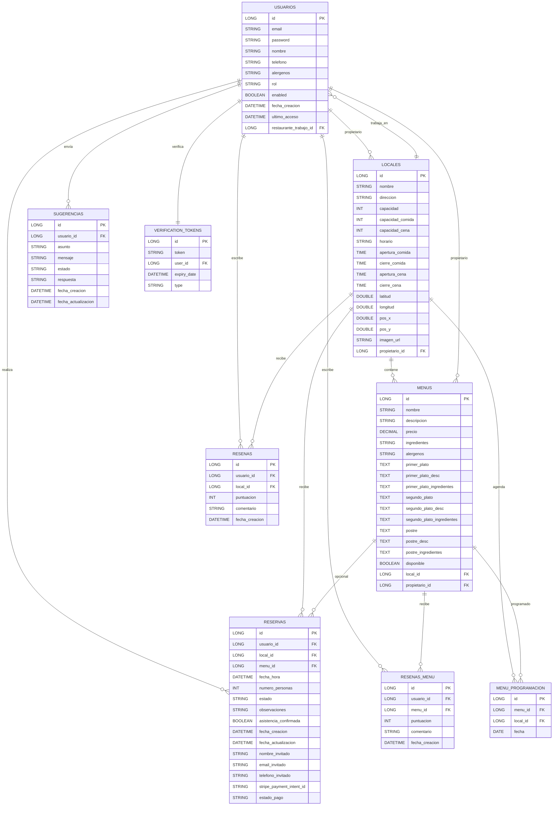

# Modelo Entidad-Relación (ER)

## Visión general
Este modelo describe las entidades principales del dominio y sus relaciones. Incluye claves primarias (PK), claves foráneas (FK) y cardinalidades clave para comprender dependencias de datos y soportar mantenimiento.

## Diagrama ER (Mermaid)

## Notas de cardinalidad y reglas
- Un usuario con rol CEO puede ser propietario de múltiples locales.
- Un empleado pertenece como máximo a un solo local (relación N:1 entre USUARIOS y LOCALES).
- Un menú puede estar asociado a un local o ser general (local_id nullable).
- Una reserva puede ser de invitado (usuario_id nullable) o de usuario registrado.
- La tabla RESENAS_MENU tiene restricción de unicidad (usuario_id, menu_id).
- La programación de menú (MENU_PROGRAMACION) limita un menú por local y fecha.
