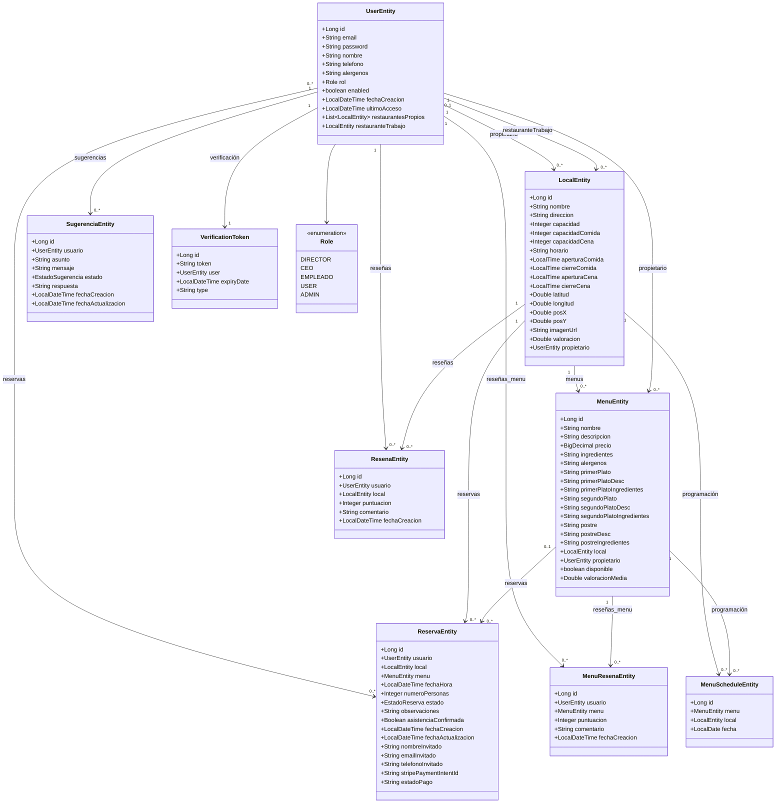

# Diagrama de Clases UML

## Diagrama (Mermaid)

## Notas
- Las clases reflejan las entidades JPA en el backend.
- Las asociaciones indican relaciones de dominio relevantes para la lógica de negocio.
